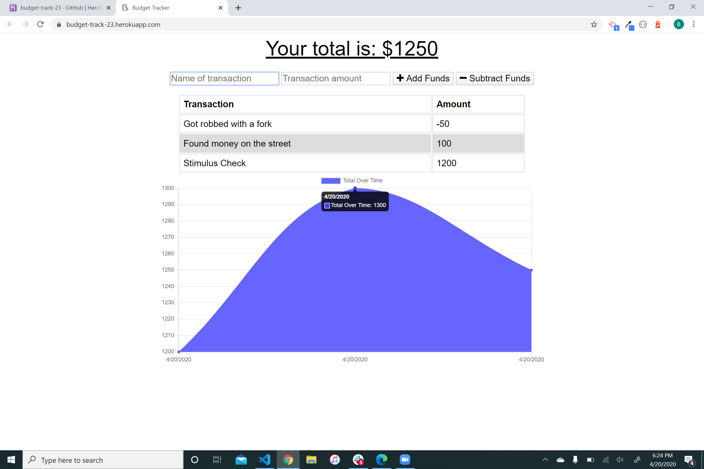
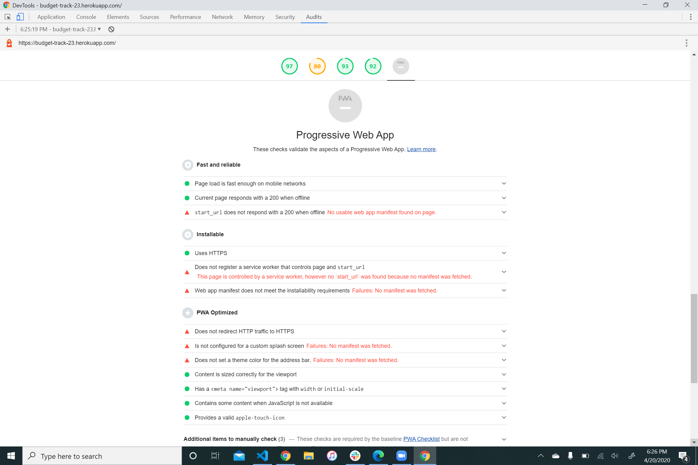

# BudgetTracker
online/offline budget tracker
## Description
A Budget progressive web application that tracks each transaction. The landing page displays your total and recent transaction histort. There is a chart that shows your spending as well. Using webpacks and service workers, the application still functions if the server ends up offline.
## Contact
Please contact me at bmalkmus@uw.edu for any support issues.
## Acknowledgment
I would like to thank of all my teachers and TAs at University of Washington's Coding Bootcamp.   
Built with:  
* Mongoose DB  
* Heroku for deployment 
* mLab   
* morgan npm  
* webpack npm  
* babel npm  
* webpack-pwa-manifest

## License
[MIT](https://choosealicense.com/licenses/mit/)

## Screenshots 
**Landing Page** 
 
   
 **Lighthouse** 
 
 
